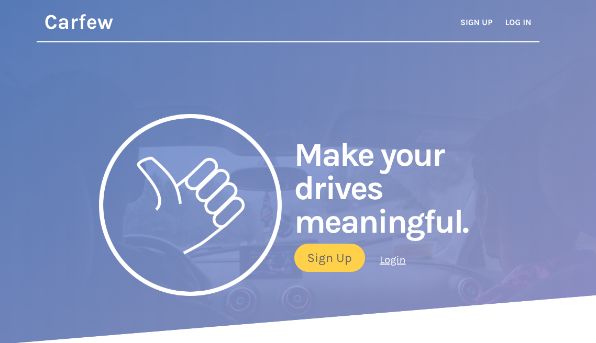
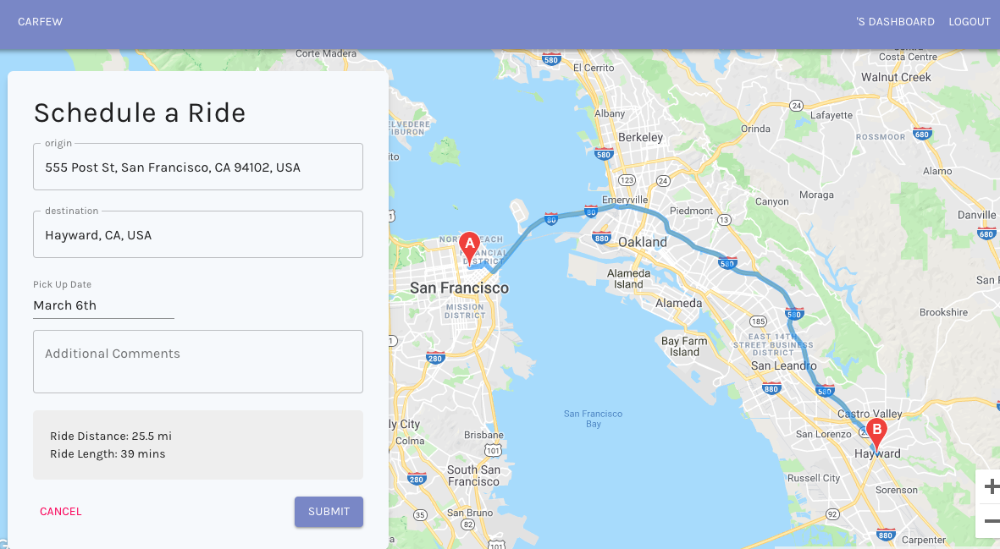

<p align="center">
    
</p>

# Carfew - Fewer cars, more friends 🤝

* [About Carfew](https://github.com/carfew/carfew/tree/dev#what-is-carfew-)
* [The Team](https://github.com/carfew/carfew/tree/dev#who-are-the-carfew-dev-team--)
* [File Structure](https://github.com/carfew/carfew/tree/dev#file-structure-)
* [See the App](#Current Build)
* [APIs](https://github.com/carfew/carfew/tree/dev#api-integration---what-apis-are-we-using--)
* [Running](https://github.com/carfew/carfew/tree/dev#running-)
* [Testing](https://github.com/carfew/carfew/tree/dev#testing-)
* [Endpoints](https://github.com/carfew/carfew/tree/dev#endpoints)
  * [Rides Endpoints](https://github.com/carfew/carfew/tree/dev#rides-)
  * [Users Endpoints](https://github.com/carfew/carfew/tree/dev#users--)
  * [Auth Endpoints](https://github.com/carfew/carfew/tree/dev#authentication-)
* [Contact Info](https://github.com/carfew/carfew/tree/dev#additional-contact-info-)

## What is Carfew? 🚘
Carfew is a new, innovative ride-sharing solution for those who want to meet new people 👋. With Carfew, you drive to make connections and meet people who like the same things that you do.

Connect with others over a mutual in-app community and request rides with people who are going the same way that you are. Its hitchhiking for the 21st century 👍.

In future iterations of this app, we would like to make communities dynamic with Reddit-style comment systems. We'd also like to allow riders to share ride costs with their drivers. We're looking into a verification system for all members of the app to make sure you're only meeting up with awesome, legit people.

This is an open-source project! Watch this repo for future updates 😉

## Why did we build Carfew? 🚗
We all believe that climate change is an inevitable reality that we have a responsibility to do something about. Fewer cars on the road is one way to help curb those effects.

Additionally, we are interested in understanding city infrastructure and being good citizens of the place where we live, San Francisco ❤️ .

Building an app that can help to limit the number of vehicles moving around the city will help make the air more breathable and the streets safer for everyone.

## Getting Started 🏃
If you would like to see the current, live version of Carfew, simply visit https://www.carfew.app/.

If you would like to run the app on your local server, you can fork and/or clone the repo. From the root route, type 'npm run starter' and the 'npm run dev' to build the react app.

Every subsequent time that you run the app without pulling updated code you can simply run 'npm run start'.

If you pull updated code from the master branch, please use 'npm run dev' so that you re-build the react app again.

## Current Build

### Landing Page
<p align="center">
    
</p>

### React App with Google API
<p align="center">
    
</p>

## Who are the Carfew dev team? 👩‍💻 👨‍💻
Our core developers are:
### Erik Batista ✨
  - Role(s): Front End Developer, UI/UX Design
  - Technologies: HTML, CSS, Handlebars, Sketch
### Colleen Ni 💫
  - Role(s): Back End Developer
  - Technologies: Node, Express, MongoDB
### Wenzel Lowe 🌟
  - Role(s): Full Stack Developer, API Integration, Gitmaster
  - Technologies: Node, Express, MongoDB, React, Google APIs (Maps, Places and Directions)
### Faith Chikwekwe ⭐️
  - Role(s): Back End Developer, Product Manager
  - Technologies: Node, Express, MongoDB, HTML, CSS, Handlebars, Github Projects

Since this is an open source project, if you see something that can be improved, feel free to open an issue or a pull request to let us know.

We are currently still developing the core idea, but once we've iterated on the main functionality, we'll be more than happy to look at community changes.

## File Structure 🗂
```
root/
|
|-- carfew-react/               # React files and dependencies
|        |--build/
|        |--public/
|        |--src/
|        |--README.md
|
|-- controllers/                # routing and logic
        |-- rides.controller.js
        |-- users.controller.js
        |-- auth.controller.js
|
|-- models/                     # database models
      |-- ride.model.js
      |-- user.model.js
|
|-- views/                      # handlebars templates
      |--layouts/
      |
      |-- partials/
|
|-- tests/                      # unit testing
      |-- rides.test.js
      |-- users.test.js
      |-- auth.test.js
|
|-- config/                     # dev and configuration
|     |-- config.js
      |-- express.js
|
|-- public/                     # static content
      |-- img/
|
|-- env files                   # environment variables
|-- index.js                    # dev server
|-- notes.md                    # unorganized notes; pre-Kanban board
|-- README.md
|-- misc
```

## API Integration - What APIs are we using? 💻 📡
- Google Places for accurate location search.
- Google Directions to get distance and directions between the origin and the destination.
- Google Maps to render the map so that the user can visualize their ride.

## Testing 📝
We used Mocha and Chai for testing. Tests are stored in 'tests/' directory.

To run tests for this project, clone the project and then type the command 'npm test' or 'mocha' into your console from the project root folder.

## Endpoints
### Rides 🚖
#### '/rides' - create ONE ride
The user can create a ride by specifying the origin, the destination and the pickup window. The ride itself creates a mixed type object that can interact with the Google Maps API to display on a map.

#### '/rides/:id' - read/show ONE ride
The user can read a single ride by clicking on it from the index view or after creating a ride. While viewing the ride, they have the option to accept the ride, if another use has posted it. They also have the option to delete the ride if it is their own.

#### '/rides/:id' - delete ONE ride
The user can delete their own posted rides. If the user goes to the show ONE route, and the ride is their own, then an option to delete should be displayed.

#### '/rides' - show ALL rides
The user can see all rides posted by users within the app. This is where the user can select rides to view in detail.

### Users 🧑 🧔
#### '/users/:id' - show ONE user
User can see and interact with their user dashboard. Access to the user dashboard is dependent on proper authorization and authentication.

#### '/users/:id/delete' - delete ONE user
User can permanently delete their profile. The user can only access this route from their dashboard and only with proper authorization.

This route will log the user out my destroying their JWT token and end their session. It also deletes their information and routes them back to the root route.

After deleting their profile, the user must create a new profile in order to gain access to the full features of the website.

### Authentication 🔐
#### '/sign-up' - get sign-up template
User can see the sign-up template and enter their sign-up information.

#### '/sign-up' - create ONE user
User sign-up information is validated and processed through a POST route. Their email address, username and phone number must all be unique in order for the login to be successful. They must also choose a password.

If successful, a JWT token will be created to keep them logged in for the duration of the session. This route will redirect to the rides index.

#### '/login' - get login template
User can see the login template and enter their login credentials.

#### '/login' - post ONE user
User login credentials are validated and processed through a POST route. Their username OR email address OR phone number must exactly match the information that we have on file. Their password must also be valid.

If successful, a JWT token will be created to keep them logged in for the duration of the session. This route will redirect to the rides index.

#### '/logout' - log user out
The route will destroy the user's JWT token removing authorization to create and delete rides and interact with their communities.

The user will be routed back to the root route.

## Additional Contact Info ☎

For questions related to Carfew development or to get in touch with the team, email Faith Chikwekwe at faith.chikwekwe@students.makeschool.com.
